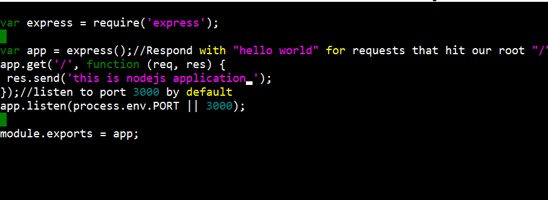
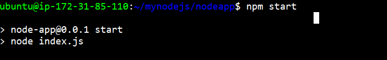
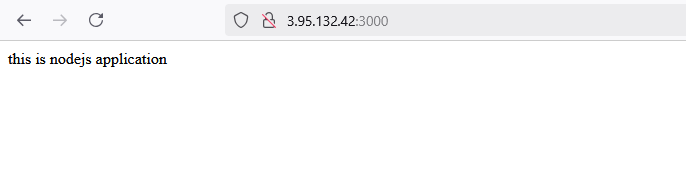
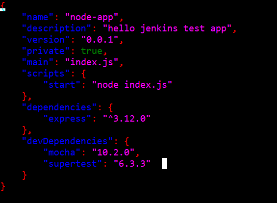

# Nodejs-App

This is a simple Node.js application that serves "Hello World" on port 3000.

## Prerequisites

- A server running a Linux distribution (e.g., Ubuntu)
- Root or sudo privileges

## Installation

1. **Update the system and install Node.js and npm:**
    ```bash
    sudo apt update
    sudo apt install nodejs npm
    ```

2. **Verify the installation:**
    ```bash
    node -v
    npm -v
    ```

3. **Set up the application directory:**
    ```bash
    mkdir mynodeapp
    cd mynodeapp
    ```

4. **Create the `package.json` file:**
    ```bash
    nano package.json
    ```
    
5. **Create the `index.js` file:**
    ```bash
    nano index.js
    ```
    
## Running the Application

To start the Node.js application, run:
```bash
npm start
```

# Project Screenshots

### 1. Index Page


### 2. NPM Start Output


### 3. Output Screenshot


### 4. Package Info
 


## Accessing the Application
Open a browser and go to http://your-public-ip-address:3000 to see your Node.jsapp running.

## License
This project is licensed under the MIT License.
